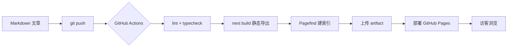
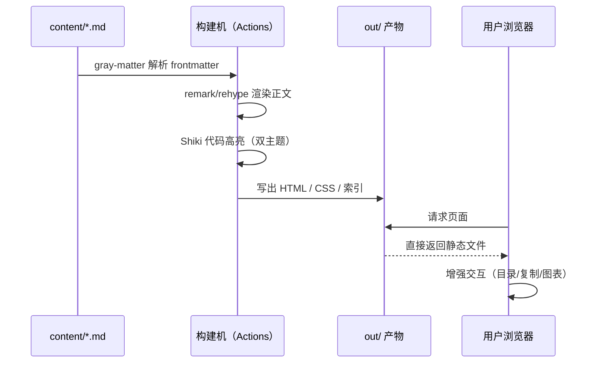

你按下 `git push` 之后，这篇文章经历了什么？这篇用两张图讲清楚本站的发布流水线。

## 全景：一条流水线走到底

整个发布链路没有服务器——全静态导出，CI 兜底：



每一步都是纯构建期动作，产物是纯静态文件。这意味着：没有运行时依赖、没有冷启动、挂了也只是「没更新」，不会「挂掉」。

## 细看：构建期与浏览期的分工

静态导出架构下，工作被切分成两段，构建期做重活，浏览器只拿结果：



## 为什么坚持全静态

- **成本恒为零**：GitHub Pages 免费托管，Actions 免费构建；
- **故障面极小**：没有进程、没有数据库，「服务不可用」这个状态不存在；
- **性能天然好**：全部文件可被 CDN 缓存，首屏只需要 HTML + 关键 CSS。

代价是动态能力受限——追番数据这类外部内容只能浏览器端拉取，这是 M3 要解决的问题。

## 小结

```
写 Markdown → push → CI 构建 → 静态上线
```

一句话：**把复杂度放进构建期，把简单留给运行时。**
