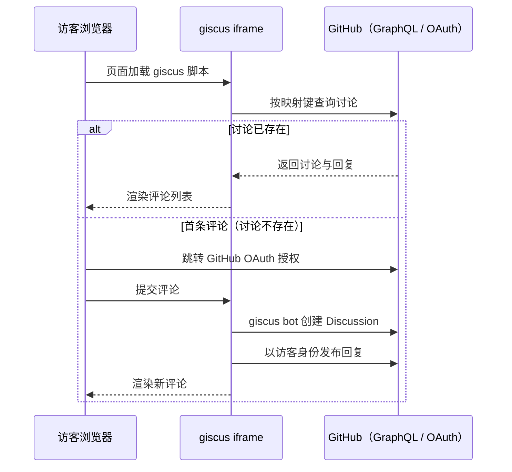

把评论系统装进一个「没有任何后端」的博客，听起来像是个伪命题——评论要存储、要鉴权、要防滥用，这些活儿传统上都是服务器干的。但这恰恰是 giscus 的巧妙之处：它把评论数据存在你仓库的 GitHub Discussions 里，把鉴权交给 GitHub OAuth，把防滥用交给 GitHub 的权限体系——你要做的只是贴一段配置。这篇记录我在自己的 Next.js 静态导出博客上接入 giscus 的全流程：先讲原理，再走配置，最后是两个官方文档里没写的坑。

> **要点速览**
>
> - 静态站评论选型：giscus（数据存 GitHub Discussions，零服务器）vs Waline/Twikoo（需自建后端），全静态架构下前者是自然解
> - 讨论分类选 Announcements 类型：访客无法手动开帖防滥用，但首条评论仍由 giscus bot 自动建讨论，不需要站长预埋
> - pathname 映射下，本地 `localhost` 发的测试评论与线上同路径页面共享同一条讨论——上线后直接可见，回链里的 localhost 只是建帖来源记录

## 为什么是 giscus

静态导出（`output: "export"`）意味着没有 API 路由、没有数据库、没有运行时。评论系统的候选其实就三类：

| 方案   | 数据存储           | 需要服务端            | 部署形态       |
| ------ | ------------------ | --------------------- | -------------- |
| giscus | GitHub Discussions | ❌                    | 纯前端 iframe  |
| Waline | 自建数据库         | ✅（Serverless/容器） | 前后端分离部署 |
| Twikoo | 自建集合           | ✅（云函数/容器）     | 前后端分离部署 |

Waline 和 Twikoo 都是成熟方案，但它们都需要你维护一个后端——哪怕托管在 Serverless 平台上，数据库、环境变量、冷启动也都是长期成本。对一个「整站就是一堆静态文件」的博客来说，为了评论区引入服务端，架构上就输了。

giscus 把这三件事全部外包给了 GitHub：评论数据 = Discussions 帖子，登录 = GitHub OAuth，防滥用 = 仓库权限体系。代价是评论者必须有 GitHub 账号——对技术博客的目标读者来说，这个代价几乎为零。

## 原理：一条评论是怎么变成 GitHub 讨论的

理解原理，后面的每个配置项都有了着落。giscus 的本体是一个挂在 `giscus.app` 域名下的 **iframe**：页面引入一段小脚本，脚本在评论区的位置创建这个 iframe，并通过 `postMessage` 与它双向通信（主题切换、高度自适应都靠这条通道）。

iframe 里跑的才是真正的逻辑，它与 GitHub 之间的交互全走官方 API：

几个关键设计：

- ** Discussions 就是数据库**。每条评论是讨论里的一个回复，表情回应就是 GitHub 原生的 reaction。数据存在你自己的公开仓库里，随时可导出、可迁移，「评论服务跑路」的风险为零。
- **鉴权交给 OAuth**。访客首次评论会跳转 GitHub 授权页（授权对象是 giscus 的 OAuth App），拿到的 token 只存在访客自己的浏览器里，用于以本人身份发评论——giscus 的服务器不保管任何人的凭证。
- **建帖由 bot 代劳**。giscus 安装到仓库时被授予了讨论读写权限，首条评论出现时由 `giscus[bot]` 创建 Discussion。这个设计正是后面「Announcements 分类」能安全使用的前提。

## 手把手配置 giscus

### 第一步：仓库侧准备

在 [giscus.app/zh-CN](https://giscus.app/zh-CN) 填仓库名之前，有两个前置条件：

1. **仓库必须是 public**——Discussions 数据本来就要公开可读，私有仓库没有意义；
2. **开启 Discussions 并安装 [giscus App](https://github.com/apps/giscus)**：仓库 Settings → General → Features → 勾选 Discussions；然后到 App 页面安装并授权仓库。这一步给了 giscus bot 读写讨论的权限，是整个系统的基石。

### 第二步：在 giscus.app 逐项配置

**映射方式（mapping）**——最重要的一个选项，决定「页面 ↔ 讨论」怎么对应：

| 映射方式             | 匹配键         | 适用场景               | 注意                |
| -------------------- | -------------- | ---------------------- | ------------------- |
| `pathname`           | 页面路径       | URL 结构稳定的博客 ✅  | 文章改路径等于断链  |
| `URL`                | 完整地址       | 带查询参数的页面       | 域名/协议变化会断链 |
| `title` / `og:title` | 页面标题       | 路径不稳定的站点       | 改标题就断链        |
| `specific`           | 手动指定字符串 | 多个页面共享一个讨论区 | 需配合 `term` 参数  |

博客选 `pathname` 最自然：文章路径一旦发布就不该再变，而匹配键不含域名，本地开发与线上环境天然共享同一片讨论。

**讨论分类（category）**——推荐 **Announcements（公告）**类型：这种分类只有维护者能在 GitHub 上手动开帖，杜绝了有人绕过评论区直接去仓库乱开讨论的滥用路径。注意它不影响访客评论——首条评论出现时 giscus bot 会自动建帖（原理见上一节，「bot 代劳」）。

**其余选项**按需：`strict`（严格匹配，普通博客选 0 即可）、表情回应（reactions）建议开启、输入框位置（评论框在上更利于互动）、主题与语言（语言选 `zh-CN`；主题若想跟随站点亮暗切换，就不要写死，留给组件动态传参——原生 `<script>` 用法可以把主题值换成运行时更新）。

**第三步：拿配置**。页面底部会生成一段 `<script>`，里面每个 `data-*` 属性都对应一个配置项，其中需要原样保存的是两个自动生成的标识符：`data-repo-id`（仓库 ID，形如 `R_xxx`）和 `data-category-id`（分类 ID，形如 `DIC_xxx`）。

### 第三步：接入自己的站点

官方提供两种 embedding 方式：直接贴原生 `<script>`（零依赖，适合任何静态站），或用官方 React 封装 [`@giscus/react`](https://github.com/giscus/giscus/tree/main/packages/giscus)（适合 React/Next 项目，主题等参数可以做成动态 props）。我把配置收敛到了站点的全局配置文件里，方便统一管理与启停。部署后实测：评论区加载、GitHub OAuth 授权、评论发布、亮暗主题跟随全部正常。

## 两个文档里没写的坑

### 坑一：本地测试的评论，线上能看到

我在本地 `localhost:3000` 测试时发了一条评论，然后去仓库 Discussions 里围观——发现正文里赫然带着 `http://localhost:3000/...` 的回链：

第一反应是「坏了，这数据是不是被本地污染了」，后来搞清楚 `pathname` 映射的匹配机制才发现完全多虑：匹配键是**路径**（`/posts/hello-world/`），与域名无关。本地和线上同一篇文章的路径完全一致，所以指向同一条讨论，评论互通。那个 localhost 回链只是 giscus 建帖时记录的「来源页面」，纯属外观问题——介意的话，删掉测试讨论，线上首评会重新建一条干净的。

这张截图还顺带验证了两件事：讨论作者是 `giscus[bot]`（Bot 徽章），评论者名字旁边挂着 `with giscus` 标注和 Maintainer 徽章——整条「bot 建帖、访客回复」的链路在数据里清晰可查。

### 坑二：Announcements 分类不需要站长预埋讨论

接坑一的误解：选了 Announcements 类型后，我曾以为每篇文章都得自己先去发一条评论「开个头」。实际上 giscus bot 的建帖权限独立于访客权限——Announcements 拦的是「人在 GitHub 界面手动开帖」，拦不住「通过评论区发首评时 bot 自动建帖」。

## 上线之后

部署后用浏览器实测：评论区加载、GitHub 授权、评论与表情回应全部正常。对这个静态博客来说，这就是评论系统的终态：数据在自己的仓库里、零服务器、访客用 GitHub 账号发言。唯一的长期变量是 giscus（以及 GitHub）在国内网络的可达性波动——好在评论区是纯增量功能，随时可以整体下线而不影响其他任何部分。
